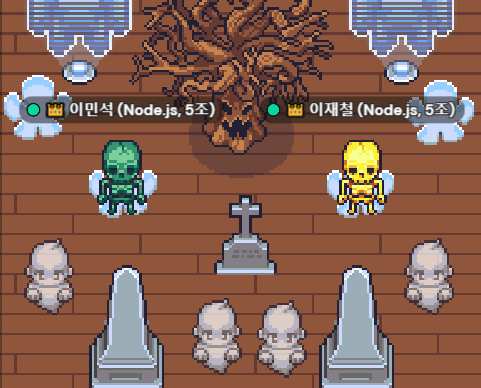

## 알고리즘 문제 풀이 (연장)

`항해99` 에서 구성된 알고리즘 팀은 `22-07-22, FRI` 에 종료되었습니다.

팀원 분들과 협의해서 앞으로 4주 간 **(`22-07-24, SUN` ~ `22-08-14, SUN`)** 더 진행하기로 하였습니다.

### 규칙

- 각 주제 별로 해당하는 문제 개인별 `1문항` 찾아오기
    - 가져온 문제는 질의 응답이 가능한 수준으로 풀이해오기
   - 팀원이 가져온 문제는 당일에 모여서 풀이하고 나누기

### 일정

| 주차 | 주제 |
| :--- | :--- |
| 1 주차 `22-07-24 09:00(am)` | 블루트 포스   투포인터 알고리즘, 슬라이딩 윈도우, 해쉬 |
| 2 주차 `22-07-31 09:00(am)` | 스텍, 큐   이분 탐색 |
| 3 주차 `22-08-07 09:00(am)` | DFS : 깊이 우선 탐색   DFS, BFS: 넓이 우선 탐색 |
| 4 주차 `22-08-14 09:00(am)` | Dynamic Programming: 동적 프로그래밍 |

### 문제 리스트

| 주차 | 문제 제목 | 담당 | 풀이 날자 | 풀이 링크 |
| :--- | :------- | :---- | :------ | :------- |
| 1주차 | [리모콘 (브루트 포스)](https://www.acmicpc.net/problem/1107) | @codeing999 |  `2022-07-24` | |
| 1주차 | [회전초밥 (투 포인터, 슬라이딩 윈도우)](https://www.acmicpc.net/problem/15961) | @codeing999 | `2022-07-24` | |
| 1주차 | [배열 돌리기 (브루트 포스)](https://www.acmicpc.net/problem/17406) | @unchaptered | `2022-07-24` | |
| 1주차 | [DNS 비밀번호 (슬라이딩 윈도우)](https://www.acmicpc.net/problem/12891) | @unchaptered | `2022-07-24` | |
| 1주차 | [ (브루트 포스)]() | @axisotherwise | `2022-07-24` | `` | |
| 1주차 | [ (해쉬)]() | @axisotherwise | `2022-07-24` | |
| 2주차 | [기능 개발(스텍, 큐)](https://school.programmers.co.kr/learn/courses/30/lessons/42586) | @axisotherwise | - |
| 2주차 | [올바른 괄호 (스텍, 큐)](https://school.programmers.co.kr/learn/courses/30/lessons/12909) | @codeing999 | `2022-08-07` |
| 2주차 | [입국심사 (이분 탐색)](https://school.programmers.co.kr/learn/courses/30/lessons/43238) | @unchaptered | `2022-08-07` | [해설](https://github.com/unchaptered/algorithm/blob/main/advanced/%EC%9E%85%EA%B5%AD%EC%8B%AC%EC%82%AC.md) |
| 3주차 | [단어 변환 (DFS, BFS)](https://school.programmers.co.kr/learn/courses/30/lessons/43163) | @unchaptered | `2022-08-07` | [해설](https://github.com/unchaptered/algorithm/blob/main/advanced/%EB%8B%A8%EC%96%B4%EB%B3%80%ED%99%98.md)|
| 3주차 | [네트워크 (DFS, BFS)](https://school.programmers.co.kr/learn/courses/30/lessons/43162) | @codeing999 | `2022-08-07` | [해설](https://github.com/unchaptered/algorithm/blob/main/advanced/%EB%84%A4%ED%8A%B8%EC%9B%8C%ED%81%AC.md) |
| 4주차 | [큰 수 만들기(Greedy)](https://school.programmers.co.kr/learn/courses/30/lessons/42883) | @unchaptered | `2022-08-07` | - |
| 4주차 | [섬 연결하기(Greedy)](https://school.programmers.co.kr/learn/courses/30/lessons/42861) | @codeing999| `2022-08-07` | - |

### 사진 📸

- `2022-08-07` @unchaptered @codeing999

- `2022-08-14` @unchaptered @codeing999

